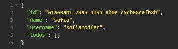

<h1 align="center">
    
</h1>

<h3 align="center">Um <em>todo</em>, em inglês, significa um afazer.</h3>

  <a href="#-instalação-e-execução">Instação e execução</a>&nbsp;&nbsp;&nbsp;|&nbsp;&nbsp;&nbsp;
    <a href="#-funcionamento">Funcionamento</a>&nbsp;&nbsp;&nbsp;|&nbsp;&nbsp;&nbsp;
  <a href="#-objetivos">Objetivos</a>

 

  

## 🛠️ Instalação e execução

1. Faça um clone desse repositório;
2. Pelo terminal, rode `yarn` para instalar as dependências;
3. Pelo terminal, rode `yarn dev` ou `node src/index.js` para inicializar a API.

## 🚀 Funcionamento

A API possui caminhos de POST para usuários e GET, POST, PUT, PATCH e DELETE para os _todos_.

### 🧒 Rotas de usuário ('/users')

`POST` - Na rota '/users', o método POST faz a inclusão do usuário no sistema. É necessário passar um `name` e `username` no corpo da requisição. Essa rota gera um ID aleatório utilizando a biblioteca UUID (v4), que fica atrelado ao usuário.

### 📝 Rotas de _todos_ ('/todos')

`POST` - Esse método recebe os parâmetros `title` e `deadline` no corpo da requisição e `username` nos headers. O _todo_ será adicionado no array de _todos_ do `username` passado. O parâmetro `deadline` precisa estar no formato yyyy-MM-dd.

`GET` - Esse método recebe apenas o parâmetro `username` nos headers, e retorna todos os _todos_ atrelados a esse usuário.

`PUT` - A rota 'todos/id' recebe os parâmetros `title` e `deadline` no corpo da requisição e `username` nos headers. Os parâmetros passados no corpo substituirão os já existentes no _todo_ selecionado através do ID presente na URL. O ID pode ser visualizado através do método `GET`.

`PATCH` - A rota 'todos/id/done' recebe apenas o parâmetro `username` nos headers. Esse método apenas muda o valor da key `done` para true, ou seja, marca o _todo_ selecionado como concluído.

`DELETE` - A rota 'todos/id' recebe apenas o parâmetro `username` nos headers. Esse método exclui o _todo_ selecionado.

## 💻 Objetivos

Essa API me ajudou a entender mais a fundo os conceitos de requisições HTML e servidores Express. Não é um projeto muito extenso, mas tentar desvendar a utilização do node me deu uma boa base do funcionamento de APIs maiores.

---

Feito com ♥ by Sofia Rodrigues Ferreira :wave: <a href="https://www.linkedin.com/in/sofiarodfer/">Contato</a>

